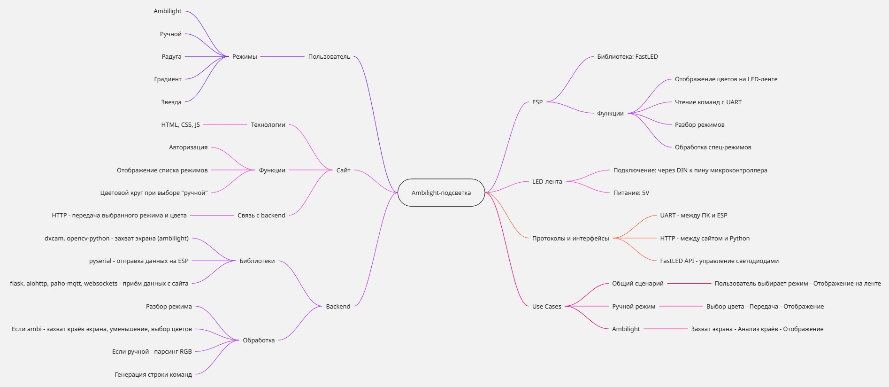

# AmbyLight

## Схема использования
1. Приобретение ленты
     - К каждой LED-ленте идет уникальный код подключения, с помощью которого в последующем можно привязать ее к своему аккаунту и управлять.
2. Регистрация на сайте
     - Заходите на сайт и создаете аккаунт: указываете логин, почту и пароль, или входите в уже существующий профиль.
3. Привязка ленты к аккаунту
     - В личном кабинете вводите уникальный код с упаковки, после чего лента появляется в списке ваших устройств.
4. Настройка ленты
     - Перейдя на нужную ленту, можно выбрать одну из опций:
         * Ambilight - подсветка в реальном времени по краям экрана
         * Ручной режим - выбираете любой цвет через цветовой круг
         * Режимы эффектов - радуга, градиент, звезда
5. Готово
     - Лента работает в выбранном режиме. Можно менять настройки в любой момент.

## Mind Map

